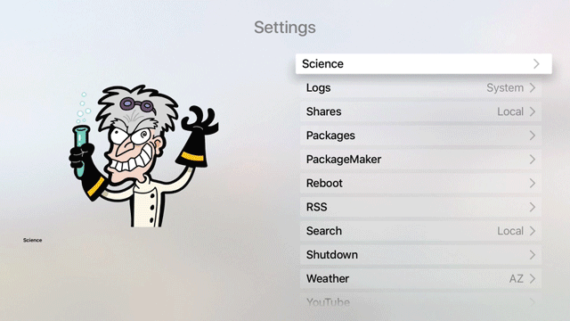

# tvOSSettingsViewAuto
Recreated tvOSSettingsView using PureLayout Auto Layout wrapper.

Creating a view with metadata and various options to change between when menu item is selected.

    - (NSArray *)items
    {
        NSDictionary *console = @{@"name": @"Logs", @"coverArt": @"http://nitosoft.com/ATV2/install/images/btstack.png", @"detail": @"System", @"detailOptions": @[@"System", @"Crash"], @"Version:": @"6.6.6", @"Author:": @"Jesus", @"description": @"Logs"};
        NSDictionary *shares = @{@"name": @"Shares", @"coverArt": @"GenericSharepoint", @"detail": @"Local", @"detailOptions": @[@"Local", @"AFP", @"SMB"], @"Version:": @"1.2.3", @"Author:": @"Hayzus", @"description": @"Different share point information, could be Local, AFP or SMB"};
        NSDictionary *packages = @{@"name": @"Packages", @"coverArt": @"package", @"detail": @"Local", @"detailOptions": @[@"Local", @"Online"], @"Version:": @"3.2.1", @"Author:": @"Yars", @"description": @"Packages that are installed"};
        NSDictionary *pm = @{@"name": @"PackageMaker", @"coverArt": @"packagemaker", @"detail": @"", @"detailOptions": @[], @"Version:": @"1.1", @"Author:": @"Wut", @"description": @"Create packages"};
        NSDictionary *reboot = @{@"name": @"Reboot", @"coverArt": @"reboot", @"detail": @"", @"detailOptions": @[], @"Version:": @"2.1", @"Author:": @"Whoosit", @"description": @"Reboot the system"};
        NSDictionary *rss = @{@"name": @"RSS", @"coverArt": @"rss", @"detail": @"", @"detailOptions": @[], @"Version:": @"1.3.4", @"Author:": @"Mr Meeseeks", @"description": @"Your favorite RSS feeds"};
        NSDictionary *search = @{@"name": @"Search", @"coverArt": @"search", @"detail": @"Local", @"detailOptions": @[], @"Version:": @"3.1", @"Author:": @"Yaz", @"description": @"Local search for files"};
        NSDictionary *shutdown = @{@"name": @"Shutdown", @"coverArt": @"Shutdown", @"detail": @"", @"detailOptions": @[], @"Version:": @"1.2.4b", @"Author:": @"Who", @"description": @"Shutdown your system"};
        NSDictionary *weather = @{@"name": @"Weather", @"coverArt": @"Weather", @"detail": @"AZ", @"detailOptions": @[@"AZ", @"PA", @"CA"], @"Version:": @"3.1.3", @"Author:": @"KayBee", @"description": @"Your favorite weather forecast"};
        NSDictionary *yt = @{@"name": @"YouTube", @"coverArt": @"YTPlaceholder", @"detail": @"", @"detailOptions": @[], @"Version:": @"3.2.3", @"Author:": @"Casey Jones", @"description": @"YouTube browser"};
        return @[[[MetaDataAsset alloc] initWithDictionary:console], [[MetaDataAsset alloc] initWithDictionary:shares], [[MetaDataAsset  alloc] initWithDictionary:packages], [[MetaDataAsset alloc] initWithDictionary:pm], [[MetaDataAsset alloc] initWithDictionary:reboot],[[MetaDataAsset alloc] initWithDictionary:rss], [[MetaDataAsset alloc] initWithDictionary:search], [[MetaDataAsset alloc] initWithDictionary:shutdown], [[MetaDataAsset alloc] initWithDictionary:weather], [[MetaDataAsset alloc] initWithDictionary:yt]];
    }

    - (BOOL)application:(UIApplication *)application didFinishLaunchingWithOptions:(NSDictionary *)launchOptions {
        // Override point for customization after application launch.
        self.window = [[UIWindow alloc] initWithFrame:[UIScreen mainScreen].bounds];
    
        UINavigationController *navController = [UINavigationController new];
        SettingsViewController *viewCon = [SettingsViewController new];
    
        viewCon.items = [self items];
        viewCon.title = @"Settings";
      //  viewCon.view.backgroundColor = [UIColor clearColor];
      //  viewCon.titleColor = [UIColor colorFromHex:@"DC1916"];
    
        navController.viewControllers = @[viewCon];
        self.window.rootViewController = navController;
    
        [self.window makeKeyAndVisible];
        return YES;
    }

