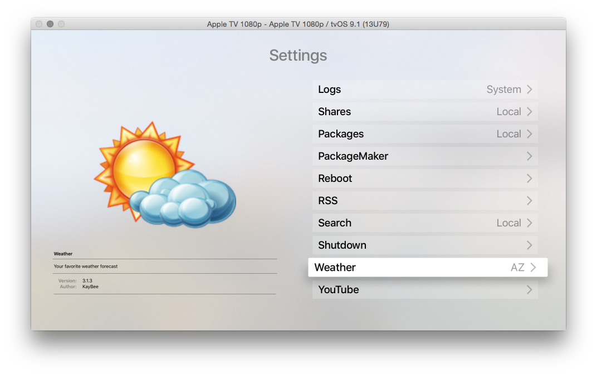

# tvOSSettingsViewAuto

This view is an attempt to recreate BRMediaMenuControllers / BRMetadataControl from AppleTV versions prior to tvOS. These classes appear to potentially exist in a private framework ATVLegacyContentKit, which will all be well and good if I was only catering to people writing jailbreak based Applications ;).

Long story short this sample gives you a basic settings style table list view on the right with a highly customized preview / metadata control on the left hand side.

The datastore can be easily created with some basic dictionaries that are converted into as MetaDataAsset's as illustrated in the example below.

The formatting of the dictionary keys / meta appears as follows.

[imagePath] //can be remote or local

[name]
-------------------------------------

[assetDescription]

-------------------------------------

[metaDictionary.key[x]]: metadataDictionary.value[x]]
..

-------------------------------------

The table view cell is as follows

[name                           detail >]

To control the different options displayed in detail you set detailOptions array in the initial dictionary or asset.
If there is detail/detailOptions available in the asset. As you select the item it will cycle through the detail options.

If you just want a basic settings menu that always has the same static image you can set defaultImageName of SettingsViewController to the image name.

Creating a view with metadata and various options to change between when menu item is selected.

    - (NSArray *)items
    {
        NSDictionary *drScience = @{@"name": @"Science", @"imagePath": @"https://dl.dropboxusercontent.com/u/16129573/dr_science.png", @"detail": @"", @"detailOptions": @[]};

        NSDictionary *console = @{@"name": @"Logs", @"imagePath": @"console", @"detail": @"System", @"detailOptions": @[@"System", @"Crash"], @"Version": @"6.6.6", @"Author": @"Jesus", @"descriptions": @"Logs"};
        NSDictionary *shares = @{@"name": @"Shares", @"imagePath": @"GenericSharepoint", @"detail": @"Local", @"detailOptions": @[@"Local", @"AFP", @"SMB"], @"Version": @"1.2.3", @"Author": @"Hayzus", @"description": @"Different share point information, could be Local, AFP or SMB"};
        NSDictionary *packages = @{@"name": @"Packages", @"imagePath": @"package", @"detail": @"", @"detailOptions": @[], @"Version": @"3.2.1", @"Author": @"Yars", @"description": @"Packages that are installed"};
        NSDictionary *pm = @{@"name": @"PackageMaker", @"imagePath": @"packagemaker", @"detail": @"", @"detailOptions": @[], @"Version": @"1.1", @"Author": @"Wut", @"description": @"Create packages"};
        NSDictionary *reboot = @{@"name": @"Reboot", @"imagePath": @"reboot", @"detail": @"", @"detailOptions": @[], @"description": @"Reboot the system"};
        NSDictionary *rss = @{@"name": @"RSS", @"imagePath": @"rss", @"detail": @"", @"detailOptions": @[], @"Version": @"1.3.4", @"Author": @"Mr Meeseeks", @"description": @"Your favorite RSS feeds"};
        NSDictionary *search = @{@"name": @"Search", @"imagePath": @"search", @"detail": @"Local", @"detailOptions": @[], @"Version": @"3.1", @"Author": @"Yaz", @"description": @"Local search for files"};
        NSDictionary *shutdown = @{@"name": @"Shutdown", @"imagePath": @"Shutdown", @"detail": @"", @"detailOptions": @[], @"Version": @"1.2.4b", @"Author": @"Who", @"description": @"Shutdown your system"};
        NSDictionary *weather = @{@"name": @"Weather", @"imagePath": @"Weather", @"detail": @"AZ", @"detailOptions": @[@"AZ", @"PA", @"CA"], @"Version": @"3.1.3", @"Author": @"KayBee", @"description": @"Your favorite weather forecast"};
        NSDictionary *yt = @{@"name": @"YouTube", @"imagePath": @"YTPlaceholder", @"detail": @"", @"detailOptions": @[], @"Version": @"3.2.3", @"Author": @"Casey Jones", @"Things": @"yes", @"description": @"YouTube browser"};

        return @[[[MetaDataAsset alloc] initWithDictionary:drScience], [[MetaDataAsset alloc] initWithDictionary:console], [[MetaDataAsset alloc] initWithDictionary:shares], [[MetaDataAsset alloc] initWithDictionary:packages], [[MetaDataAsset alloc] initWithDictionary:pm], [[MetaDataAsset alloc] initWithDictionary:reboot],[[MetaDataAsset alloc] initWithDictionary:rss], [[MetaDataAsset alloc] initWithDictionary:search], [[MetaDataAsset alloc] initWithDictionary:shutdown], [[MetaDataAsset alloc] initWithDictionary:weather], [[MetaDataAsset alloc] initWithDictionary:yt] ];
    }

    - (BOOL)application:(UIApplication *)application didFinishLaunchingWithOptions:(NSDictionary *)launchOptions {
        // Override point for customization after application launch.
        self.window = [[UIWindow alloc] initWithFrame:[UIScreen mainScreen].bounds];
    
        UINavigationController *navController = [UINavigationController new];
        SettingsViewController *viewCon = [SettingsViewController new];
    
        viewCon.defaultImageName = @"package";
        viewCon.items = [self items];
        viewCon.title = @"Settings";
        
        /*
            if you want to set the background color to something different from default
           it will update all the layers necessary with the new colors and if blackColor is chosen text will be made 
           white where necessary
       
        */
       //  viewCon.view.backgroundColor = [UIColor blackColor];
      //  viewCon.titleColor = [UIColor colorFromHex:@"DC1916"];
    
        navController.viewControllers = @[viewCon];
        self.window.rootViewController = navController;
    
        [self.window makeKeyAndVisible];
        return YES;
    }

